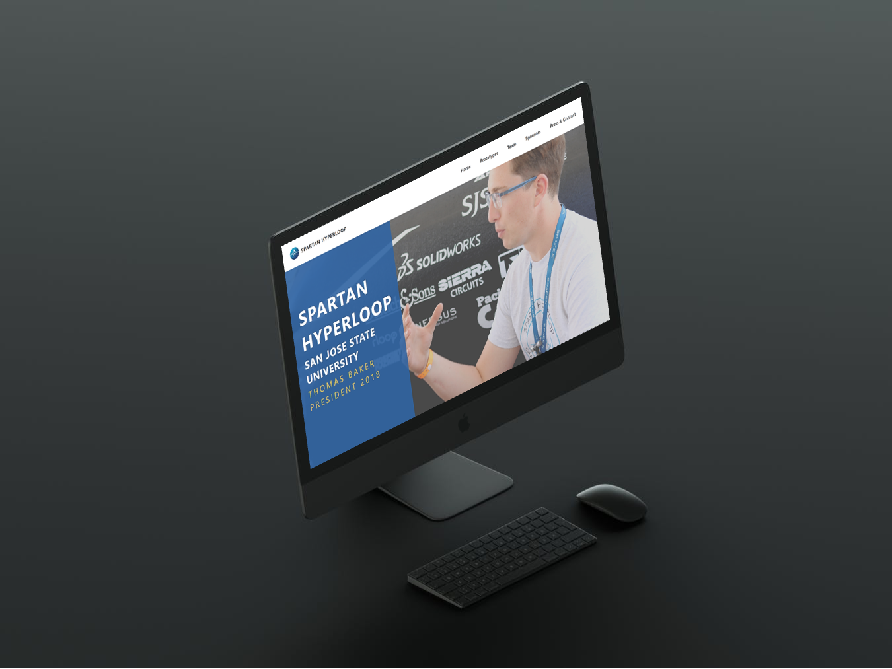

# Spartan Hyperloop

Spartan Hyperloop was established with the dream of building next-generation technology for the future of transportation. Through the development of future professionals within our team, we have begun to make our dream come true. We have made it to the final round of the 2018 SpaceX Hyperloop Competition. This summer, we will be competing at SpaceX in hopes of winning it all.
Spartan Hyperloop operates out of the Silicon Valley at San Jose State University in sunny California. San Jose State University is known for being among the top producers of student talent for the Silicon Valley and for its diversity. 
